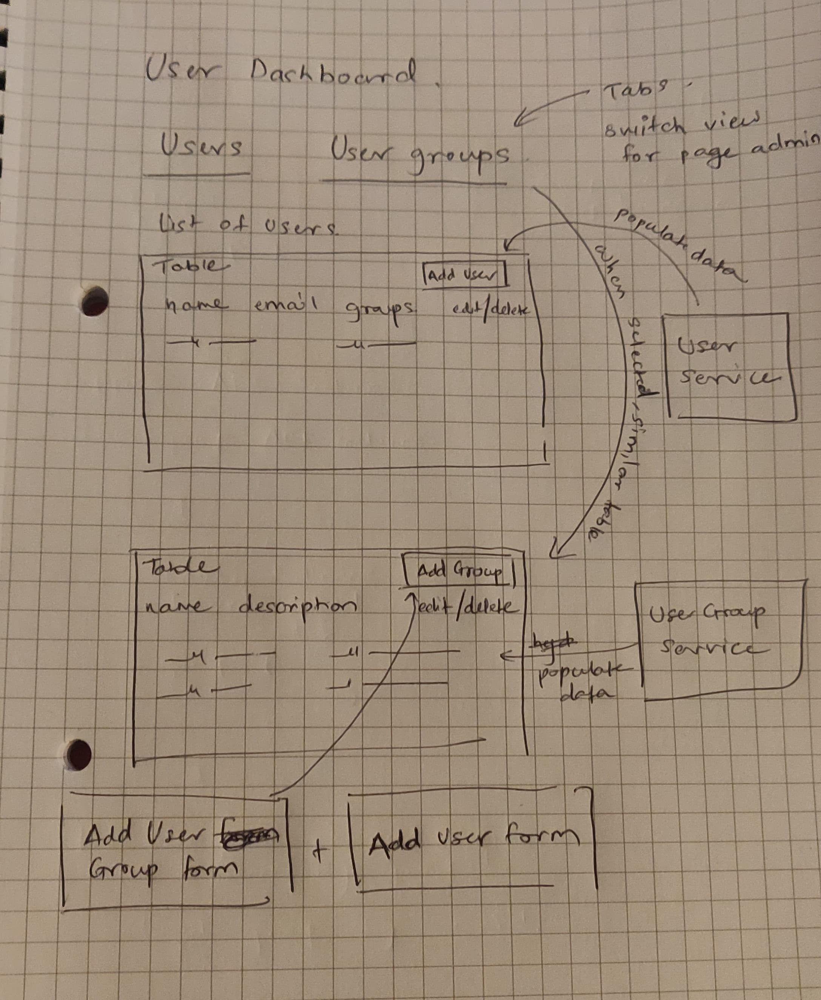

# UserManagement

This is a work in progress application that aimed to build a user management application.
Although incomplete, at the moment list of users and list of groups are displayed with 
the help of dummy services.

## Setup

After cloning this repository, run `npm install` to install all the dependencies.

## Development server

Run `npm run start` for a dev server. 
Navigate to `http://localhost:4200/` to view the application.

## Build

Run `npm run build` to build the project. The build artifacts will be stored in the `dist/` directory.

Rough plan/Notes:

